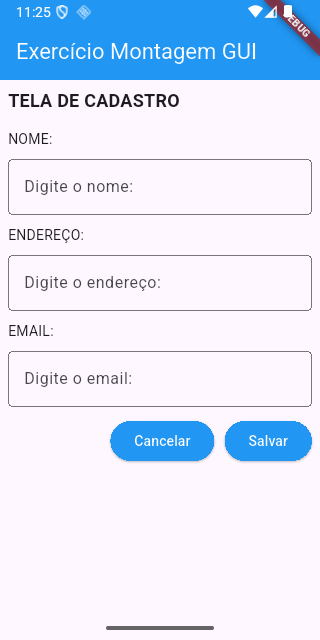
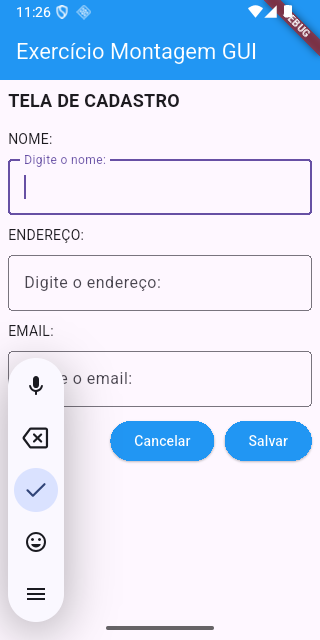

# Avaliação 2: Montagem de uma GUI
---
Este é um aplicativo desenvolvido em Flutter como parte da disciplina Desenvolvimento Multiplataforma 1 do curso de Especialização em Desenvolvimento de Sistemas para Dispositivos Móveis do IFSP - Câmpus São Carlos.

O objetivo deste projeto é desenvolver uma interface de usuário (UI), explorando diversos widgets do Flutter e componentes do Material UI.

## Screenshots
---
Abaixo estão algumas capturas de tela do aplicativo, disponíveis na pasta `screenshots/`:

